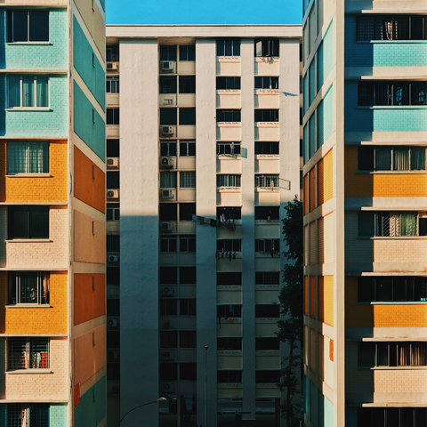

Filter
=======

Original Image

Gaussian Blur
-------------

.. pil-block::

    from pilkit.processors.filter import GaussianBlur

    old_img = Image.open('original.jpg')
    blur = GaussianBlur(1)
    new_img = blur.process(old_img)

.. pil-block::

    from pilkit.processors.filter import GaussianBlur

    old_img = Image.open('original.jpg')
    blur = GaussianBlur(5)
    new_img = blur.process(old_img)

.. pil-block::

    from pilkit.processors.filter import GaussianBlur

    old_img = Image.open('original.jpg')
    blur = GaussianBlur(10)
    new_img = blur.process(old_img)
